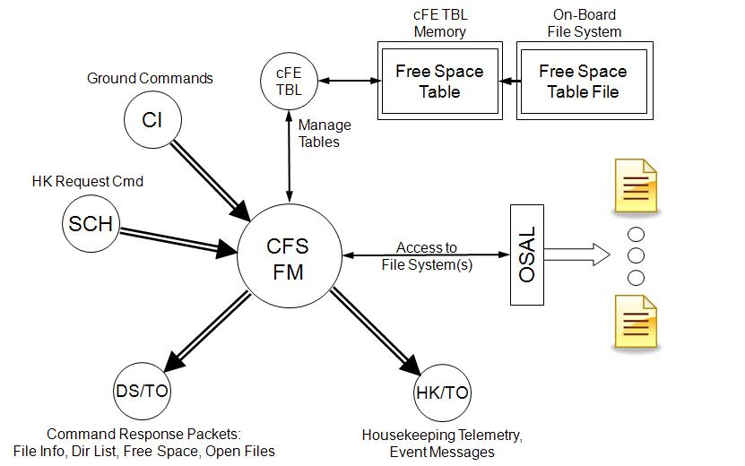

# cFS: File Manager

* [Original README](cfs-fm-app-OSS-readme.txt)

## Description

The File Manager application (FM) is a core Flight System (cFS) application that
is a plug in to the Core Flight Executive (cFE) component of the cFS.

The cFS is a platform and project independent reusable software framework and
set of reusable applications developed by NASA Goddard Space Flight Center. This
framework is used as the basis for the flight software for satellite data
systems and instruments, but can be used on other embedded systems. More
information on the cFS can be found at http://cfs.gsfc.nasa.gov

The FM application provides onboard file system management services by
processing ground commands for copying, moving, and renaming files,
decompressing files, creating directories, deleting files and directories,
providing file and directory informational telemetry messages, and providing
open file and directory listings.

## Requirements

* [Operating System Abstraction Layer][osal] 4.1.1 or higher
* [core Flight Executive][cfe] 6.4.1 or higher
* [cFS Application Library][cfs_lib]

## Sources

* https://sourceforge.net/projects/cfs-fm/

[osal]: https://github.com/yusend/osal
[cfe]: https://github.com/yusend/coreflightexec
[cfs_lib]: https://github.com/yusend/cfs_lib
